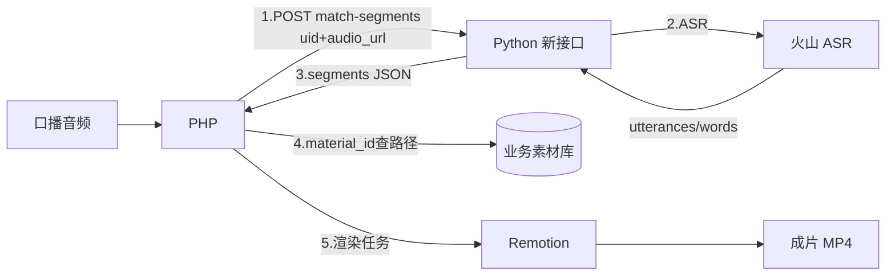
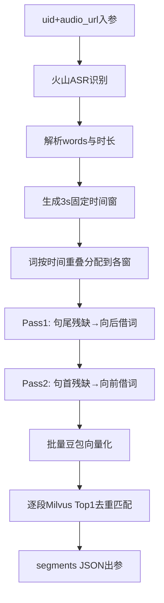

# 3 秒分句素材匹配 — 项目执行方案

面向产品、PHP 联调方与业务验收方。本文说明项目目标、职责划分、接口规格、算法逻辑、预期效果与实施里程碑。

---

## 一、项目目标

将口播音频（通过 `audio_url` 传入）自动处理为**严格 3 秒一段**的口播文案 + 素材匹配结果，供 PHP 打包传给 Remotion 渲染短视频。

**核心约束：**

1. 文案时长、素材播放时长、画面时长、时间轴**四者同步**（每段固定 3 秒）
2. 每个 3 秒片段**强制返回 1 条素材**（禁止空素材、黑屏、无画面）
3. 支持批量任务与高并发扩容，满足大批量短视频自动化生产

**本次 Python 服务范围：**

- 接收 PHP 传入的 `audio_url`，由服务端调用火山 ASR 获取词级时间戳
- 3 秒语义智能分句
- 豆包向量化 + Milvus Top1 匹配
- 输出结构化 JSON

**不在 Python 范围内：** 素材路径查询、Remotion 渲染（由 PHP / 前端负责）

---

## 二、系统协作与职责划分



| 角色 | 职责 | 输入 | 输出 |
|------|------|------|------|
| **PHP** | 上传/获取音频 URL；组装请求；按 `material_id` 查素材路径；驱动 Remotion | 音频文件 | 渲染任务数据 |
| **Python 新接口** | 调用火山 ASR；3 秒语义分句；向量化；Top1 素材匹配 | `uid` + `audio_url` | segments JSON |
| **Remotion** | 按 3 秒段裁剪素材、叠字幕、合成视频 | segments + 素材路径 | 成片 |
| **Milvus 向量库**（已有） | 存储素材向量，支持余弦检索 | 离线灌库 | 相似度 Top1 |
| **火山豆包 Embedding**（已有） | 分句文本在线向量化 | 文本 batch | 2048 维向量 |

---

## 三、接口规格

### 3.1 基本信息

| 项目 | 值 |
|------|-----|
| 方法 | `POST` |
| 路径 | `/material/match-segments` |
| Content-Type | `application/json` |
| 在线文档 | 服务启动后 `{BaseURL}/docs` |

### 3.2 入参

**标准请求示例（推荐）：**

PHP 侧只需传入 `uid` 与公网可访问的 `audio_url`，ASR 识别由 Python 服务端内部完成。

```json
{
  "uid": 13,
  "audio_url": "https://tulingai-1318672529.oss-cn-hangzhou.aliyuncs.com/uploads/voice/20260423/volcano_volcano_69e9d2575f2fb_3787_1776931442.mp3"
}
```

**带候选素材列表的请求示例：**

去重后的候选数量决定片段数，音频时长均分，不再固定 3 秒切分。

```json
{
  "uid": 13,
  "audio_url": "https://tulingai-1318672529.oss-cn-hangzhou.aliyuncs.com/uploads/voice/20260423/volcano_volcano_69e9d2575f2fb_3787_1776931442.mp3",
  "candidate_material_ids": [4777, 4675, 5205, 5218]
}
```

**字段说明：**

| 字段 | 类型 | 必填 | 说明 |
|------|------|------|------|
| `uid` | int | **是** | 业务用户 ID；未传候选列表时，Milvus 默认过滤 `uid == {uid}` |
| `audio_url` | string | **是** | 公网可访问的音频 URL；服务端据此调用火山 ASR |
| `candidate_material_ids` | int[] | 否 | 待选素材 ID 列表；非空时片段数 = 去重后候选数，音频均分，每段 `material_id` 不重复 |
| `filter` | string | 否 | 自定义 Milvus 标量过滤；与候选列表同时传入时取交集 |

**高级模式（联调/测试可选）：** 若 PHP 侧已持有 ASR 结果，也可直接传 `result.utterances`（需同时提供 `audio_info.duration` 或 `result.additions.duration`），此时可省略 `audio_url`。生产环境以 `uid` + `audio_url` 为准。

### 3.3 出参

**完整响应示例（33.167s 音频 → 12 段，此处展示 2 段）：**

```json
{
  "api_version": "v2-dual-text",
  "audio_duration_ms": 33167,
  "segment_duration_sec": 3,
  "total_segments": 12,
  "segments": [
    {
      "index": 0,
      "start_sec": 0,
      "end_sec": 3,
      "raw_text": "老板们我是帅亿磁设备公司负",
      "query_text": "老板们我是帅亿磁设备公司负责人王楚君我们已经为来自",
      "text": "老板们我是帅亿磁设备公司负",
      "material_id": 4777,
      "similarity_score": 0.5277
    },
    {
      "index": 1,
      "start_sec": 3,
      "end_sec": 6,
      "raw_text": "责人王楚君我们已经为来自",
      "query_text": "老板们我是帅亿磁设备公司负责人王楚君我们已经为来自",
      "text": "责人王楚君我们已经为来自",
      "material_id": 4675,
      "similarity_score": 0.5292
    }
  ]
}
```

**字段说明：**

| 字段 | 类型 | 说明 |
|------|------|------|
| `api_version` | string | 固定 `v2-dual-text` |
| `audio_duration_ms` | int | 音频总时长（毫秒） |
| `segment_duration_sec` | int | 固定为 **3** |
| `total_segments` | int | `ceil(audio_duration_ms / 3000)` |
| `segments[].index` | int | 段序号，从 0 开始 |
| `segments[].start_sec` | int | 起始秒：0, 3, 6, 9 … |
| `segments[].end_sec` | int | 结束秒：3, 6, 9, 12 … |
| `segments[].raw_text` | string | 3 秒窗口内按词硬切的口播文案（字幕展示用） |
| `segments[].query_text` | string | 语义补全后的检索文本（向量化用） |
| `segments[].text` | string | 与 `raw_text` 相同，兼容旧消费方 |
| `segments[].material_id` | int | 匹配素材 ID（**每段必有，全局不重复**） |
| `segments[].similarity_score` | float | 余弦相似度，越大越相似（**不设低分过滤**） |

**说明：**

- **不返回** `material_path`，PHP 按 `material_id` 查业务库获取路径
- 每段 `end_sec - start_sec` 恒等于 3，可直接用于 Remotion 时间线
- 段数计算：`33167ms → ceil(33167/3000) = 12` 段（0–3, 3–6, …, 33–36）
- `text` 供 Remotion 叠字幕；`query_text` 仅供向量检索，二者可能不同

### 3.4 错误响应

| HTTP | 场景 | detail 示例 |
|------|------|-------------|
| 400 | 参数缺失、ASR 失败 | `audio_url or result.utterances is required` |
| 400 | Milvus 无匹配 | `向量库无可用素材: filter=..., unmatched_segments=...` |
| 422 | JSON 格式 / 类型校验失败 | Pydantic 校验错误详情 |

---

## 四、算法实现说明

整体流水线：**固定 3 秒切轴 → 词级分配 → 语义借词优化 → 批量向量化 → Top1 匹配**



### Step 1：时间切轴

**无候选列表（默认）：** 固定 3 秒切轴，段数 = `ceil(音频毫秒 / 3000)`。

**有候选列表：** 段数 = 去重后 `candidate_material_ids` 数量，音频时长均分：

```
window_ms[i] = duration_ms * (i+1) // N - duration_ms * i // N
```

- 时间轴边界由均分决定，语义借词只调整各窗内文本归属

### Step 2：词级分配

- 将 ASR 每个 `word`（毫秒级 `start_time` / `end_time`）按与时间窗的**重叠关系**分配到对应窗口
- 按词序拼接为初始文本

### Step 3：语义优化分句（核心，替代 PHP 硬切）

| 情况 | 判定 | 处理方式 |
|------|------|----------|
| **句尾被截断** | 有文本但未以 `。！？；.!?;` 结尾 | 从**下一窗口**借词，直到句末标点 |
| **句首被截断** | 当前窗是句子后半段 | 从**上一窗口**借词，补全句子前半 |
| **文本过短** | 字符数低于阈值 | 先向后借，仍短再向前借 |
| **文本过长** | 单窗文本超过阈值 | **完整保留**，不强行拆分 |
| **静音空窗** | 该 3 秒无口播词 | 展示 `text` 为空；匹配时用邻段语义检索，**仍返回 material_id** |

**借词规则：**

- 分两轮执行（Pass1 句尾 → Pass2 句首），避免相邻窗口抢词
- 被借走的词从源窗口移除，**相邻段不重复同一段文本**

### Step 4：批量向量化

- 每段生成 `query_text`（空窗用邻段文本）
- 一次 API 调用批量生成全部段落向量（豆包 Embedding，2048 维）

### Step 5：Top1 素材匹配（硬性规则）

| 规则 | 说明 |
|------|------|
| 检索方式 | Milvus 余弦相似度（COSINE） |
| 每段取 Top1 | `limit=1`，在可用素材中取最高分 |
| **全局去重** | 每段 `material_id` 不重复；已分配的 ID 在后续片段通过 `material_id not in [...]` 排除 |
| 不设阈值 | 低分素材正常纳入，不做过滤 |
| **强制有素材** | 每段必须返回 1 个 `material_id`，禁止 null |
| 范围过滤（无候选） | 默认 `uid == {uid}` |
| 范围过滤（有候选） | 仅 `material_id in [候选列表]`，不叠加 `uid`；片段数 = 候选数 |
| 候选无匹配 | 不降级到全库，返回 `向量库无可用素材` |

---

## 五、预期效果

### 5.1 功能效果

| 验收项 | 预期结果 |
|--------|----------|
| 时间对齐 | 每段严格 3 秒，Remotion 可直接按 `index` 排列时间线 |
| 段数准确 | 47.352s → 16 段，公式 `ceil(ms/3000)` |
| 素材覆盖 | N 段各 1 条 `material_id`，零空段、零黑屏 |
| 素材去重 | 同一请求内各段 `material_id` 互不相同 |
| 候选驱动分句 | 传 `candidate_material_ids` 时，片段数 = 候选数，音频时长均分 |
| 语义质量 | 相比 PHP 纯硬切，分句更完整，向量匹配更准确 |
| 低分处理 | 低相似度素材仍正常返回，由全局排序自然决定 Top1 |

### 5.2 性能与扩展

| 指标 | 预期 |
|------|------|
| 单次延迟 | 约 16 段/次，预计 1–3 秒（主要取决于 Embedding API） |
| 批量生产 | 无状态服务，支持多 worker / 多实例水平扩容 |
| 兼容性 | 原有 `/milvus/*` 接口不受影响，新功能独立模块交付 |

### 5.3 对比 PHP 原有方案

| 维度 | PHP 硬切 | 新 Python 方案 |
|------|----------|----------------|
| 分句依据 | 纯时间硬切 | 3 秒固定轴 + 语义借词 |
| 跨句处理 | 句子易被截断 | 双向借词补全句首/句尾 |
| 素材匹配 | PHP 侧自行处理 | 统一向量 Top1，规则一致 |
| 输出格式 | 不统一 | 标准 JSON，Remotion 可直接消费 |

---

## 六、PHP 侧调用流程

```
1. 上传/获取口播音频，得到公网可访问的 audio_url
2. （可选）准备候选素材 ID 列表；传入后片段数 = 候选数，音频均分
3. POST /material/match-segments
     { uid, audio_url }
   或 { uid, audio_url, candidate_material_ids: [...] }
4. Python 服务端内部：火山 ASR → 分句（无候选 3 秒 / 有候选均分）→ 向量匹配（每段 material_id 不重复）
5. 遍历 response.segments：
     - 字幕文案：segments[i].text（或 raw_text）
     - 时间区间：start_sec ~ end_sec（各 3 秒）
     - 素材路径：material_id → 查业务库 → 传给 Remotion
6. Remotion 按段裁剪素材、叠字幕、合成成片
```

---

## 七、项目实施里程碑

| 阶段 | 周期建议 | 交付物 | 验收标准 |
|------|----------|--------|----------|
| **P1 模块骨架** | 1–2 天 | 新接口可访问、Swagger 文档、入参校验 | 非法请求正确报错 |
| **P2 分句算法** | 2–3 天 | 3 秒硬切 + 双向借词、样例 JSON 单测 | 47s 样例输出 16 段，边界与文案符合预期 |
| **P3 匹配流水线** | 1–2 天 | 批量向量化 + Milvus Top1 | 每段必有 material_id + similarity_score |
| **P4 联调** | 2–3 天 | PHP 对接、Milvus 灌库确认 | 端到端 Remotion 可渲染成片 |
| **P5 上线** | 1 天 | 多 worker 部署、监控 | 批量任务稳定运行 |

**前置条件：**

- Milvus `ai_material_embedding` 已灌库且含对应 `uid` 的素材向量
- 火山 Embedding API Key 已配置
- 火山 ASR API 已配置，且 `audio_url` 可被服务端公网访问

---

## 八、风险与协作注意

1. **ASR 质量**：分句效果依赖火山 ASR 返回的 `words` 时间戳精度；若仅有 utterance 级时间戳，语义优化效果会下降
2. **末段空白**：口播在 47.352s 结束，但第 16 段时间轴为 45–48s，Remotion 需处理末段后半无口播的情况（静音/定格）
3. **向量库为空**：无法满足「强制有素材」，联调前需确认 Milvus 已灌库
4. **material_path**：由 PHP 负责，Python 只返回 `material_id`

---

## 相关文档

- 接口详细说明（实现后）：[`api_reference.md`](./api_reference.md)
- 操作与测试指南：[`operation_and_test_guide.md`](./operation_and_test_guide.md)
